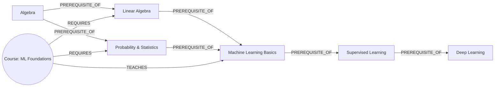

# Skilltree

A learning-path planner built on a skill/course prerequisite graph. Tell it what you
already know, pick a skill you want to reach, and it plots the shortest sequence of
skills — and a course for each one — to get you there. It also tells you what you're
ready to learn *right now*, with zero planning required.

Built for the Wexa AI take-home assignment, backed by **CognoDB** (openCypher over
Bolt) via the official Neo4j Python driver.


*(Screenshot placeholder — see "Screenshots" below.)*

---

## Why a graph database?

Prerequisite relationships are the whole point of this app, and they don't have a
fixed depth. "What do I need before Deep Learning?" might be 1 hop away (Supervised
Learning) or 5 hops away (Arithmetic → Algebra → Linear Algebra → ... ). In a
relational schema, answering that means either:

- a fixed number of self-joins (breaks the moment the chain gets one hop longer than
  you planned for), or
- a recursive CTE, which most engines support but which gets significantly harder
  once you also want to **exclude** an arbitrary "known skills" set from the
  traversal, or compute the **intersection** of two different skills' prerequisite
  trees (see "common ancestors" below).

In Cypher, both of those are a single variable-length pattern:

```cypher
MATCH (ancestor:Skill)-[:PREREQUISITE_OF*1..8]->(target:Skill {id: $id})
```

The other query that sold this use case: **"what can I learn next?"** — every skill
the learner doesn't know yet, where *every* direct prerequisite is already known.
That's a per-node anti-join over a variable-size neighborhood (some skills have zero
prerequisites, some have three). In SQL you'd write a correlated `NOT EXISTS`
subquery per candidate skill and hope the optimizer is kind to it. In Cypher it's a
pattern match with a negated existential subquery, and it reads the way you'd
describe the rule in English:

```cypher
MATCH (s:Skill)
WHERE NOT s.id IN $known
  AND NOT EXISTS {
        MATCH (p:Skill)-[:PREREQUISITE_OF]->(s)
        WHERE NOT p.id IN $known
      }
```

None of this is contrived to justify the tech choice after the fact — a course
catalog with prerequisites is a graph by nature. Rows and foreign keys can model it,
but every interesting question about it ("how far away," "what's shared," "what's
newly reachable") is a traversal question, and that's what a graph database is for.

---

## Data model

**Nodes**
- `Skill {id, name, category, description}` — 46 seeded skills across Math,
  Fundamentals, Web Dev, Data Science, DevOps, and Systems.
- `Course {id, title, provider, level, duration_hours, description}` — 34 seeded
  courses.

**Relationships**
- `(:Skill)-[:PREREQUISITE_OF]->(:Skill)` — the source skill must be learned before
  the target skill. Forms a DAG.
- `(:Course)-[:TEACHES]->(:Skill)` — a course grants a skill.
- `(:Course)-[:REQUIRES]->(:Skill)` — a course expects a skill coming in.



Full graph: 46 `Skill` nodes, 34 `Course` nodes, ~55 `PREREQUISITE_OF` edges, ~40
`TEACHES` edges, ~55 `REQUIRES` edges — comfortably inside CognoDB's free-tier limits.

---

## The queries (`backend/queries.py`)

All queries are parameterized through the Neo4j driver — no string-built Cypher
anywhere in the codebase.

| Query | What it does | Why it's graph-native |
|---|---|---|
| `get_prerequisite_chain` | Every ancestor of a target skill, at any depth | Multi-hop variable-length traversal (`*1..8`) |
| `get_frontier_skills` | "What can I learn next" | Anti-join over a variable-size neighborhood per node |
| `get_missing_prereq_subgraph` | Every skill still standing between the learner and a target, plus the edges between them | Variable-depth traversal + set subtraction against an arbitrary "known" set |
| `get_common_ancestors` | Skills that are prerequisites of **both** of two target skills | Intersection of two independent variable-length traversals |
| `get_best_course_for_skill` | Picks the course for a skill whose own `REQUIRES` set is already satisfied | One-hop lookup with a computed readiness flag |
| `get_skill_detail` | Direct prerequisites, direct dependents, and courses for one skill | One-hop neighborhood fan-out |

`get_missing_prereq_subgraph` returns nodes + edges; the actual **ordering** into a
linear learning sequence is a topological sort done in `backend/pathing.py`. The
graph query answers "which skills, at any depth, are still in the way" — a plain
`for` loop is the right tool for turning that small subgraph into a line, so that's
what does it, rather than forcing it into a single wall of Cypher.

---

## Project structure

```
skilltree/
├── backend/
│   ├── main.py          FastAPI app: routes, error handling, serves the frontend
│   ├── db.py             CognoDB driver connection + error translation
│   ├── queries.py        All Cypher, parameterized
│   ├── pathing.py         Topological sort for learning-path ordering
│   ├── seed_data.py      Loads data/*.json into CognoDB
│   ├── requirements.txt
│   └── data/
│       ├── skills.json
│       └── courses.json
├── frontend/
│   ├── index.html
│   ├── styles.css
│   └── app.js            No build step — fetches the API, renders with vis-network
├── render.yaml            Render.com deploy blueprint
├── Procfile                Generic PaaS start command
└── .env.example
```

---

## Setup

### 1. Create your CognoDB instance

1. Go to [console.cognodb.com/signup](https://console.cognodb.com/signup) and sign
   up (no credit card needed).
2. Create a free **c0** instance and pick a region. It provisions in under a minute.
3. Copy the connection URI (`bolt+s://<instance-id>.databases.cognodb.cloud`) and the
   generated password for user `cognodb` — **the password is shown once**, so save it
   immediately.

### 2. Configure environment variables

```bash
cp .env.example .env
# then edit .env with your COGNODB_URI and COGNODB_PASSWORD
```

### 3. Install dependencies and seed the graph

```bash
cd backend
pip install -r requirements.txt
python seed_data.py           # loads skills + courses (safe to re-run, idempotent)
# python seed_data.py --reset # use this instead if you need to wipe and reload
```

### 4. Run the app

```bash
uvicorn main:app --reload --port 8000
```

Open **http://localhost:8000** — the FastAPI app serves both the API (`/api/*`) and
the frontend from the same origin, so there's nothing else to run.

---

## Deploying (free tier)

**Render.com** (recommended — `render.yaml` is already set up as a Blueprint):

1. Push this repo to GitHub.
2. In Render, "New +" → "Blueprint" → point at your repo. It reads `render.yaml`
   automatically.
3. Set the `COGNODB_URI` and `COGNODB_PASSWORD` environment variables in the Render
   dashboard (they're marked `sync: false` in the blueprint so they're never stored
   in the repo).
4. Deploy. Render builds `backend/` and runs `uvicorn main:app`.

Any other PaaS that reads a `Procfile` (Railway, Heroku-style platforms) works the
same way — set the two environment variables and deploy.

---

## Error handling

If CognoDB is unreachable or credentials are wrong, `db.py` raises a single
`DatabaseUnavailableError` that a FastAPI exception handler turns into a clean `503`
with a plain-English message — the frontend shows this as a full-screen error state
with a **Retry** button rather than a blank page or a stack trace.

---

## Using AI assistance

This submission was built with AI-assisted coding. All code, the data model, and the
query design were reviewed and can be walked through and defended line by line.

---

## Screenshots

*(Replace these placeholders with real screenshots of your running instance before
submitting — the app needs to be pointed at a live CognoDB instance to render.)*

- `docs/screenshot-graph.png` — the main skill map view
- `docs/screenshot-path.png` — a plotted learning path in the side drawer
- `docs/screenshot-detail.png` — the skill detail panel
