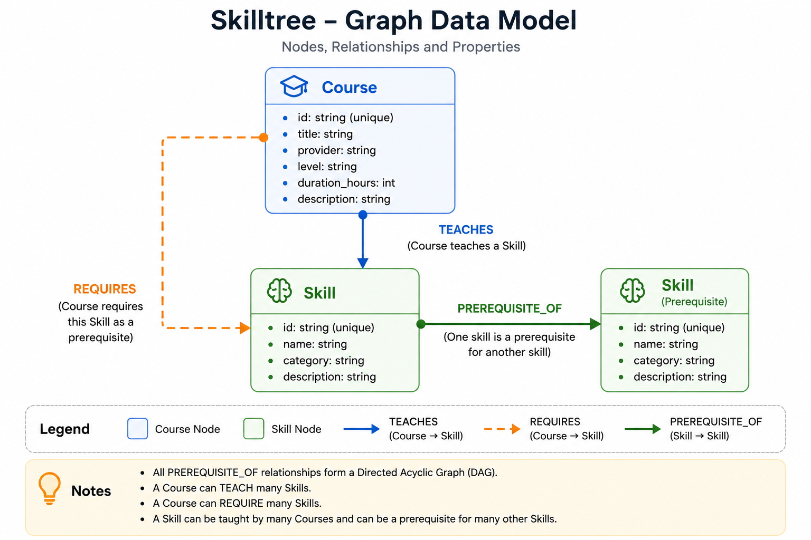
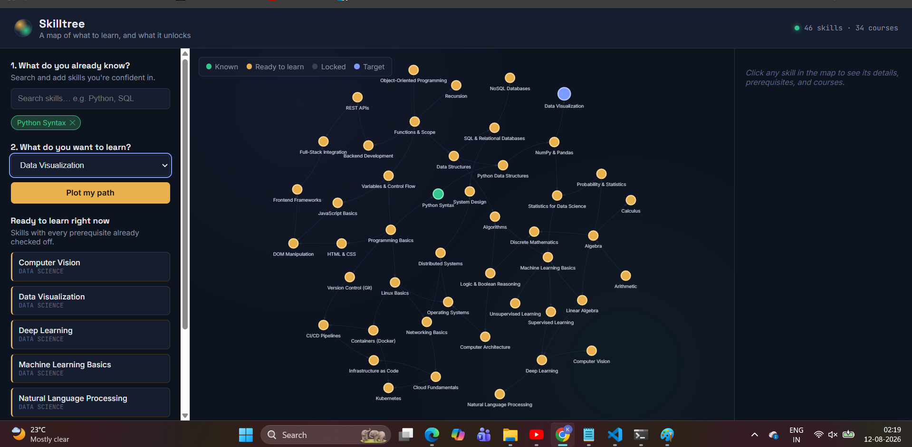
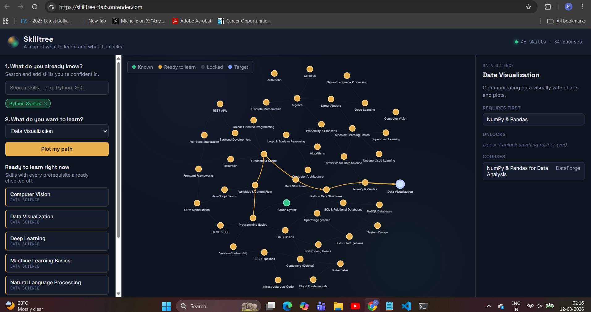

# Skilltree 🌳

A graph-powered learning-path planner that helps you answer three simple questions:

* **What should I learn next?**
* **What do I need to learn before a target skill?**
* **Which course should I take for each skill?**

Skilltree uses a prerequisite graph to understand the relationship between skills and courses. Tell it what you already know, choose a target skill, and it calculates an ordered learning path to reach that target.

---

## 🚀 Live Demo

[**Open Skilltree Live Demo**](https://skilltree-f0u5.onrender.com/)

The application is deployed on Render and backed by **CognoDB**.

---

## ✨ Features

### 1. Interactive Skill Graph

Explore relationships between skills through an interactive graph.

Each skill can be:

* 🟢 **Known**
* 🟡 **Ready to learn**
* ⚫ **Locked**
* 🔵 **Target**

The graph makes prerequisite relationships visually understandable instead of presenting them as a flat course list.

### 2. Personalized Learning Path

Select a target skill and tell Skilltree what you already know.

The application:

1. Finds the prerequisite subgraph.
2. Removes skills you already know.
3. Orders the remaining skills using topological sorting.
4. Recommends a suitable course for each step.

### 3. "What Can I Learn Next?"

Skilltree identifies skills whose prerequisites are already satisfied.

For example:

```text
Python Syntax
      ↓
Programming Basics
      ↓
Python Data Structures
      ↓
NumPy & Pandas
      ↓
Data Visualization
```

### 4. Skill Details

Clicking a skill provides information about:

* Direct prerequisites
* Skills it unlocks
* Related courses
* Skill description

### 5. Common Ancestors

Skilltree can find skills that are prerequisites for two different target skills.

This demonstrates a graph query that naturally benefits from traversing and intersecting prerequisite relationships.

---

## 🧠 Why a Graph Database?

Prerequisite relationships are the core of this application, and they don't have a fixed depth.

For example:

```text
Arithmetic
    ↓
Algebra
    ↓
Linear Algebra
    ↓
Machine Learning
    ↓
Deep Learning
```

A user may ask:

> **"What do I need to learn before Deep Learning?"**

That can require traversing multiple prerequisite levels.

In a relational database, this could require recursive CTEs or multiple joins. It becomes more complicated when we also need to:

* Exclude skills the learner already knows.
* Find all missing prerequisites at arbitrary depth.
* Find the intersection of prerequisites of two target skills.
* Determine which skills are currently unlocked.

In Cypher, these relationships can be represented naturally using variable-length graph traversals.

For example:

```cypher
MATCH (ancestor:Skill)-[:PREREQUISITE_OF*1..8]->(target:Skill {id: $id})
RETURN ancestor
```

The **"what can I learn next?"** query is also naturally expressed as a graph condition:

```cypher
MATCH (s:Skill)
WHERE NOT s.id IN $known
  AND NOT EXISTS {
        MATCH (p:Skill)-[:PREREQUISITE_OF]->(s)
        WHERE NOT p.id IN $known
      }
RETURN s
```

The application is therefore not using a graph database simply for the sake of using one. The primary questions in the application are about **connections, paths, dependencies, and reachability**, which are graph-native problems.

---

## 🗂️ Data Model

Skilltree uses two main node types:

* **Skill**
* **Course**

And three relationship types:

* `PREREQUISITE_OF`
* `TEACHES`
* `REQUIRES`

### Graph Data Model



### Nodes

#### Skill

```text
Skill {
    id,
    name,
    category,
    description
}
```

The project contains **46 seeded skills** across areas such as:

* Mathematics
* Fundamentals
* Web Development
* Data Science
* DevOps
* Systems

#### Course

```text
Course {
    id,
    title,
    provider,
    level,
    duration_hours,
    description
}
```

The project contains **34 seeded courses**.

### Relationships

```text
(:Skill)-[:PREREQUISITE_OF]->(:Skill)

(:Course)-[:TEACHES]->(:Skill)

(:Course)-[:REQUIRES]->(:Skill)
```

### Relationship Meaning

#### PREREQUISITE_OF

```text
Skill A ──PREREQUISITE_OF──> Skill B
```

Skill A must be learned before Skill B.

#### TEACHES

```text
Course ──TEACHES──> Skill
```

The course teaches the corresponding skill.

#### REQUIRES

```text
Course ──REQUIRES──> Skill
```

The course expects the learner to already know that skill.

The prerequisite relationships form a **directed acyclic graph (DAG)**.

---

## 📊 Graph Size

The seeded graph contains approximately:

| Element                         | Count |
| ------------------------------- | ----: |
| Skills                          |    46 |
| Courses                         |    34 |
| `PREREQUISITE_OF` relationships |   ~55 |
| `TEACHES` relationships         |   ~40 |
| `REQUIRES` relationships        |   ~55 |

This dataset comfortably fits within the CognoDB free-tier limits while being large enough to demonstrate meaningful graph traversal.

---

## 🔍 Main Graph Queries

All Cypher queries are located in:

```text
backend/queries.py
```

All queries use the official Neo4j Python driver and parameterized Cypher.

No user input is directly concatenated into Cypher strings.

### 1. Prerequisite Chain

**Function**

```text
get_prerequisite_chain
```

**Purpose**

Finds every ancestor of a target skill.

**Graph operation**

Variable-length traversal:

```cypher
MATCH (ancestor:Skill)-[:PREREQUISITE_OF*1..8]->(target:Skill {id: $id})
```

This is a multi-hop graph traversal.

### 2. What Can I Learn Next?

**Function**

```text
get_frontier_skills
```

**Purpose**

Finds skills that:

* The learner does not already know.
* Have no prerequisite that remains unknown.

Conceptually:

```cypher
MATCH (s:Skill)
WHERE NOT s.id IN $known
  AND NOT EXISTS {
        MATCH (p:Skill)-[:PREREQUISITE_OF]->(s)
        WHERE NOT p.id IN $known
      }
RETURN s
```

This is one of the graph-native queries in the application because it checks the prerequisite neighborhood of every candidate skill.

### 3. Missing Prerequisite Subgraph

**Function**

```text
get_missing_prereq_subgraph
```

**Purpose**

Finds all skills that still stand between the learner and their target.

The query:

1. Traverses prerequisites.
2. Removes skills already known by the learner.
3. Returns the remaining nodes.
4. Returns the relationships connecting them.

The resulting subgraph is then passed to the application's pathing algorithm.

### 4. Learning Path

**Function**

```text
build_learning_path
```

The graph query determines which skills are required.

The Python code in:

```text
backend/pathing.py
```

then performs a topological sort to order those skills into a valid learning sequence.

This separation keeps the Cypher focused on graph traversal while using normal application code for the final ordering.

### 5. Common Ancestors

**Function**

```text
get_common_ancestors
```

**Purpose**

Finds skills that are prerequisites for both of two target skills.

This is useful when a learner wants to know which foundational concepts are shared between two learning goals.

It demonstrates the advantage of treating prerequisite relationships as a graph that can be independently traversed and intersected.

### 6. Best Course for a Skill

**Function**

```text
get_best_course_for_skill
```

**Purpose**

Finds a course that teaches a particular skill while checking whether the course's own required skills are already satisfied.

This connects the course graph with the skill prerequisite graph.

### 7. Skill Details

**Function**

```text
get_skill_detail
```

**Purpose**

Returns the direct neighborhood of a skill:

* Direct prerequisites
* Skills unlocked by it
* Related courses

This is a one-hop graph fan-out.

---

## 🏗️ Architecture

```text
┌─────────────────────┐
│       Browser       │
│     HTML / CSS / JS │
└──────────┬──────────┘
           │
           │ HTTP
           ▼
┌─────────────────────┐
│       FastAPI       │
│    backend/main.py  │
└──────────┬──────────┘
           │
           ▼
┌─────────────────────┐
│      queries.py     │
│    Parameterized    │
│    Cypher queries   │
└──────────┬──────────┘
           │
    Neo4j Python Driver
           │
           ▼
┌─────────────────────┐
│       CognoDB       │
│    Graph Database   │
└─────────────────────┘
```

### Backend

The backend uses:

* Python
* FastAPI
* Neo4j Python driver
* openCypher
* CognoDB

### Frontend

The frontend is intentionally lightweight:

* HTML
* CSS
* JavaScript
* vis-network

There is no frontend build step.

---

## 📁 Project Structure

```text
skilltree/
│
├── backend/
│   ├── main.py
│   ├── db.py
│   ├── queries.py
│   ├── pathing.py
│   ├── seed_data.py
│   ├── requirements.txt
│   │
│   └── data/
│       ├── skills.json
│       └── courses.json
│
├── frontend/
│   ├── index.html
│   ├── styles.css
│   └── app.js
│
├── docs/
│   ├── data-model.png
│   ├── screenshot-graph.png
│   ├── screenshot-path.png
│   └── screenshot-detail.png
│
├── render.yaml
├── Procfile
├── .env.example
├── .gitignore
└── README.md
```

---

## ⚙️ Setup

### 1. Create a CognoDB Instance

Create a CognoDB account and create a free `c0` instance.

Then:

1. Create a free `c0` instance.
2. Select a region.
3. Wait for the instance to provision.
4. Copy the connection URI.
5. Save the generated password.

The connection URI has a form similar to:

```text
bolt+s://<instance-id>.databases.cognodb.cloud
```

The username is:

```text
cognodb
```

> **Important:** CognoDB displays the generated password only once, so save it securely.

### 2. Environment Variables

Create a `.env` file based on `.env.example`.

Example:

```env
COGNODB_URI=bolt+s://<instance-id>.databases.cognodb.cloud
COGNODB_USER=cognodb
COGNODB_PASSWORD=<your-password>
```

Credentials are read from environment variables and are not committed to the repository.

### 3. Install Dependencies

From the project root:

```bash
cd backend
pip install -r requirements.txt
```

### 4. Seed the Database

Run:

```bash
python seed_data.py
```

This loads the skills and courses into CognoDB.

The seed operation is designed to be safe to run again.

If supported by the seed script, the database can also be reset with:

```bash
python seed_data.py --reset
```

### 5. Run Locally

From the backend directory:

```bash
uvicorn main:app --reload --port 8000
```

Then open:

```text
http://localhost:8000
```

The FastAPI application serves both:

* API endpoints under `/api/*`
* Frontend static files

Therefore, no separate frontend development server is required.

---

## 🔌 API Endpoints

| Endpoint                      | Purpose                         |
| ----------------------------- | ------------------------------- |
| `/api/health`                 | Database/application health     |
| `/api/skills`                 | List skills                     |
| `/api/graph`                  | Get complete skill graph        |
| `/api/skill/{skill_id}`       | Skill details                   |
| `/api/skill/{skill_id}/chain` | Prerequisite chain              |
| `/api/next`                   | Skills currently ready to learn |
| `/api/path`                   | Generate learning path          |
| `/api/common-ancestors`       | Find common prerequisites       |

Example:

```text
GET /api/next?known=python,programming-basics
```

---

## 🛡️ Error Handling

The application handles database connectivity problems gracefully.

If CognoDB is unreachable or credentials are incorrect:

1. `db.py` translates the database error into `DatabaseUnavailableError`.
2. FastAPI catches the exception.
3. The API returns HTTP `503`.
4. The frontend displays a clear error state.
5. The user can retry instead of seeing a blank screen or stack trace.

Example response:

```json
{
  "error": "database_unavailable",
  "message": "Skilltree can't reach the graph database right now."
}
```

---

## 🚀 Deployment

The project is configured for deployment on **Render**.

The repository includes:

```text
render.yaml
```

The deployment configuration:

* Uses Python.
* Builds the backend dependencies.
* Runs Uvicorn.
* Reads CognoDB credentials from environment variables.

### Hosted Application

[**Skilltree Live Demo**](https://skilltree-f0u5.onrender.com/)

### Required Render Environment Variables

```text
COGNODB_URI
COGNODB_USER
COGNODB_PASSWORD
```

The URI and password should be configured through Render's environment-variable settings rather than committed to GitHub.

> **Note:** The free Render instance may take a few seconds to wake up after inactivity.

---

## 🖼️ Screenshots

### Main Skill Graph


### Learning Path



### Skill Details



---

## 🎥 Short Screen Recording

A short screen recording demonstrating the Skilltree application is available here:
** a seprate link is provided in email **

The recording demonstrates:

1. Opening the application.
2. Exploring the skill graph.
3. Selecting known skills.
4. Viewing available next skills.
5. Selecting a target skill.
6. Generating a personalized learning path.
7. Viewing course recommendations and skill details.

---

## 🧪 Example User Flow

A typical user can:

```text
1. Open Skilltree
       ↓
2. Select the skills they already know
       ↓
3. View skills they can learn next
       ↓
4. Select a target skill
       ↓
5. Skilltree traverses the prerequisite graph
       ↓
6. Known skills are removed
       ↓
7. Remaining skills are topologically ordered
       ↓
8. A suitable course is suggested for each step
```

This creates a personalized learning path instead of requiring the user to manually understand the prerequisite graph.

---

## 📌 Engineering Decisions

### Parameterized Cypher

All database queries use parameters through the official Neo4j driver.

This avoids building Cypher statements by concatenating user input.

### Graph Traversal in the Database

The database handles:

* Multi-hop prerequisite traversal
* Dependency discovery
* Graph intersections
* Prerequisite filtering

### Topological Ordering in Application Code

Once the relevant prerequisite subgraph is retrieved, `pathing.py` performs the topological sort.

This keeps the graph queries focused on graph operations and keeps ordering logic easy to understand and test.

### Single Deployable Service

FastAPI serves the frontend directly, which makes deployment simpler because there is no separate frontend server required.

---

## 🤖 Using AI Assistance

This project was built with AI-assisted coding.

AI assistance was used during development, but the application architecture, graph model, Cypher queries, seed data, deployment configuration, and implementation were reviewed.

The code is structured so that the project can be walked through and defended line by line.

---

## 📋 Assignment Requirements Coverage

| Wexa Requirement               | Skilltree Implementation                                    |
| ------------------------------ | ----------------------------------------------------------- |
| CognoDB graph database         | CognoDB over Bolt                                           |
| Thoughtful graph model         | Skill + Course nodes and typed relationships                |
| Data-model diagram             | `docs/data-model.png`                                       |
| Realistic seed data            | `skills.json` + `courses.json`                              |
| Seed script                    | `backend/seed_data.py`                                      |
| Multi-hop traversal            | Variable-length `PREREQUISITE_OF` traversal                 |
| Relationally awkward query     | Frontier skills / common ancestors / prerequisite traversal |
| Parameterized Cypher           | Neo4j driver parameters                                     |
| Functional web application     | FastAPI + HTML/CSS/JS                                       |
| Loading / empty / error states | Frontend states                                             |
| Environment variables          | CognoDB credentials                                         |
| Graceful DB errors             | `DatabaseUnavailableError` + HTTP 503                       |
| Hosted demo                    | Render                                                      |
| UI screenshots                 | `docs/`                                                     |
| Source code                    | GitHub repository                                           |
| Data-loading scripts           | `backend/seed_data.py`                                      |
| Cypher queries                 | `backend/queries.py`                                        |
| Short screen recording         | Demo recording link                                         |

---

## 🔗 Links

### GitHub Repository

**[Skilltree GitHub Repository](github-repository-link)**

### Live Demo

**[Skilltree Live Demo](https://skilltree-f0u5.onrender.com/)**


---

## 👨‍💻 Author

**Kshitij Bajpai**

Built as a take-home assignment for **Wexa AI** using **CognoDB** as the graph database layer.
